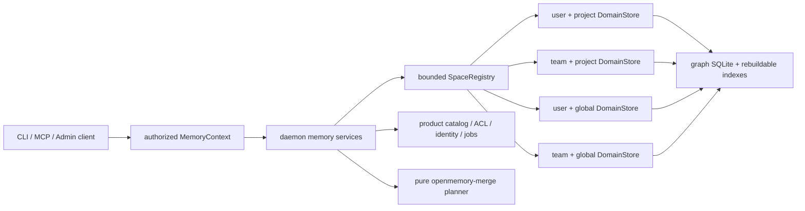

# Production Memory Spaces, Audit, and Merge

## Status

Implementation-ready production plan. No production Rust code is changed by
this plan.

The plan is grounded in committed `main` at
`bcd10fd3f736290c536ac94daf5a9014ef711828` (`openmemory` 0.4.4, Rust 1.85).
The isolated prototype and its real-world fixtures remain design evidence, not
production dependencies.

## Outcome

Implement one coherent feature set:

- Physically isolated personal-project, team-project, personal-global, and
  team-global memory spaces.
- A bounded, authorized, explainable read context and one explicit write
  target for every request.
- Immutable semantic revisions, reviewable changesets, manual edit/delete/
  restore/revert, and a typed git-like diff.
- Conservative cross-space identity resolution in which matching names or
  embeddings discover candidates but never prove identity.
- Overlay, cherry-pick, and directional material merge with complete
  provenance, contribution preservation, deterministic plans, and old-or-new
  crash recovery.
- Backward-compatible CLI/MCP behavior for an existing single-profile install.

## Fixed architectural choices

These are decisions, not questions for the implementing agent.

| Concern | Decision |
|---|---|
| Semantic isolation | One memory space owns one complete `DomainStore` root. A `DomainStore` domain remains only a performance shard inside that space. |
| Existing data | The existing `data/<profile>/` root becomes the installation owner's personal-global space in place. It is not copied at upgrade. |
| Read behavior | Resolve an immutable ordered read set of at most four spaces. Never scan the space catalog on recall. |
| Write behavior | One request writes one authorized space. Cross-domain interactive changesets are rejected before insertion. |
| Team V1 | Local-first team scopes with explicit local membership and roles. No remote sync or invented cloud authority. Agent credentials may propose team writes but cannot approve them. |
| Audit | Canonical graph changes and compact history commit in the same graph SQLite transaction. Semantic edits create immutable revisions. |
| Search correctness | SQLite is authoritative. A durable index outbox detects lag; recall repairs it or returns a typed unavailable/degraded error rather than silently serving stale content. |
| Identity | Lineage or compatible source-verified unique identifiers may decide identity deterministically. Otherwise a human reviews; an agent may only propose a bounded, packet-bound decision. |
| Merge | Overlay is the default. Material merge is directional, immutable-snapshot based, contribution preserving, staged, verified, and promoted by same-filesystem rename. |
| Merge code | A new small, pure `openmemory-merge` crate owns canonical types, hashing, evidence validation, and deterministic planning. It performs no I/O and calls no model. |
| Runtime orchestration | `openmemory-engine` owns space manifests, layered recall, snapshot/export, materialization, and promotion/recovery primitives. |
| Control plane | `openmemory-daemon` owns the catalog, authorization/context resolution, lazy runtime registry, review policy, identity ledger, and jobs. |
| Compatibility | Existing tool names and request shapes remain valid. Old requests default to the personal-global space when no project mapping exists. |

## Document map

Read and implement in this order.

| Document | Purpose |
|---|---|
| [00-head-assessment.md](00-head-assessment.md) | Exact `HEAD` reviewed, crate roles, quality baseline, test/benchmark rigor, and risks that constrain the implementation. |
| [01-contract-and-invariants.md](01-contract-and-invariants.md) | Product contract, vocabulary, types, context rules, authorization, invariants, non-goals, and stable failures. |
| [02-architecture-and-files.md](02-architecture-and-files.md) | Dependency direction, exact crate/module change map, public service boundaries, and compatibility adapters. |
| [03-persistence-and-migrations.md](03-persistence-and-migrations.md) | On-disk layout, space manifests, product/graph schema migrations, index outbox, snapshot hashes, and legacy migration. |
| [04-changesets-and-manual-editing.md](04-changesets-and-manual-editing.md) | Changeset state machine, atomic apply, review, typed diff, edit/delete/restore/revert, and index synchronization. |
| [05-context-and-team-spaces.md](05-context-and-team-spaces.md) | Catalog, workspace mapping, local team authority, resolver, registry, bounded layered recall, caching, and seamless agent context. |
| [06-identity-and-merge.md](06-identity-and-merge.md) | Candidate discovery, evidence trust, agent boundary, merge algorithm, preview diff, materialization, and recovery. |
| [07-surfaces-and-compatibility.md](07-surfaces-and-compatibility.md) | Admin endpoints/DTOs, CLI commands, MCP additions, auth capabilities, stable wire compatibility, and docs. |
| [08-test-performance-and-release.md](08-test-performance-and-release.md) | Unit/property/integration/crash/security matrix, permanent fixtures, benchmarks, budgets, CI, and release blockers. |
| [09-delivery-sequence.md](09-delivery-sequence.md) | Reviewable implementation slices, dependencies, exit criteria, rollout, rollback, and final definition of done. |
| [PROMPT.md](PROMPT.md) | Self-contained prompt to hand to an implementation agent. |

The prior [validated design](../15-memory-spaces-audit-and-merge.md) and
[`LOGBOOK.md`](../../LOGBOOK.md) explain how the choices were reached. This
directory is the execution specification and takes precedence if wording
differs.

## Runtime shape

The arrows from the registry are bounded by the resolved read set, not by the
number of catalog rows.

## Implementation rules

1. Preserve the workspace MSRV, feature matrix, formatting, Clippy, rustdoc,
   `cargo-deny`, no-unsafe posture, and deterministic-test conventions.
2. Prefer small typed modules. Do not append this feature to the 2,164-line
   daemon `lib.rs`, 1,606-line partition module, or 774-line admin DTO file.
3. Do not copy the experiment crate wholesale. Port invariants and generic
   algorithms behind production types and production error handling.
4. Do not use display names, filesystem paths, caller `source`, fuzzy strings,
   embeddings, agent confidence, or timestamps as authorization or automatic
   cross-space identity proof.
5. Do not claim atomicity across independent domain SQLite databases. Use one
   domain-local transaction or a staged whole-root promotion.
6. Do not make startup proportional to corpus size. Backfills are resumable
   jobs; legacy rows get lazy baseline revisions on first mutation.
7. Do not let proposed/conflicted state enter canonical graph rows or indexes.
8. Do not merge derived state: access counts, caches, vector/FTS files,
   journals, partition stubs, and mirror edges are rebuilt or re-derived.
9. Every phase must keep existing default, all-feature, and no-default-feature
   behavior working before the next phase starts.
10. Finish only when every acceptance gate in this package is satisfied and
    the final implementation report contains measured evidence.

## Final definition of done

- Project A cannot see Project B unless an authorized overlay or merge is
  explicitly requested.
- Personal and team layers are distinguishable in every result and audit row.
- Every new semantic write is explainable as an applied or pending changeset.
- Users can inspect, edit, supersede, retire, restore, and revert memory without
  direct SQLite access.
- Two entities named `cerpheus` remain separate by default; coalescence requires
  current proof or a current reviewed decision bound to both revisions.
- Every merge candidate and every source object is completely accounted for;
  unresolved/stale input fails closed.
- A material-merge crash reopens either the verified old target or verified new
  target, never a mixture, and never modifies the source.
- Fixed correctness fixtures and repeated benchmark runs pass on macOS and
  Linux, followed by the full workspace release gate.

